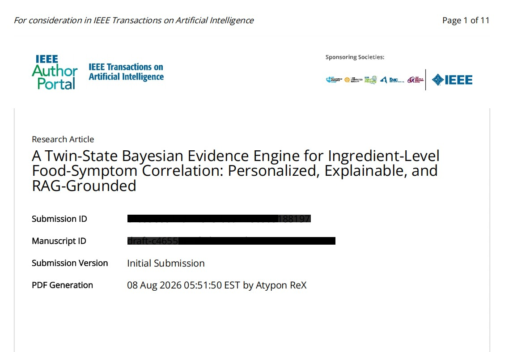
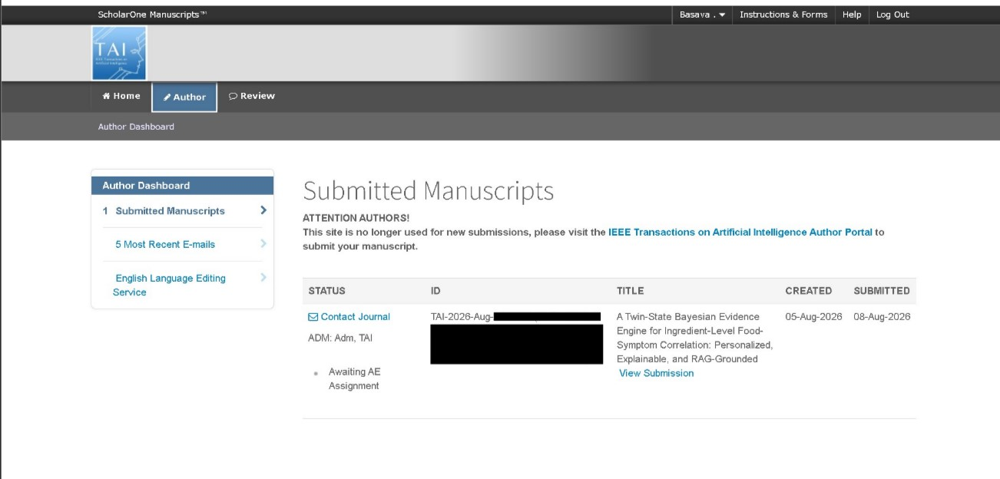
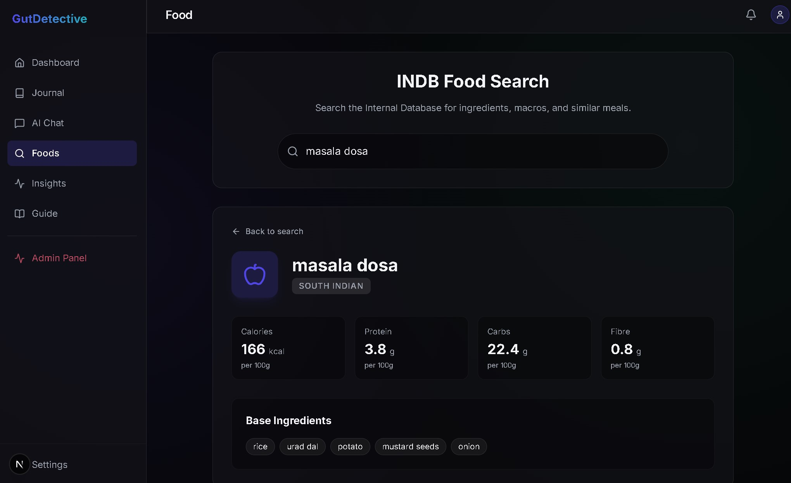
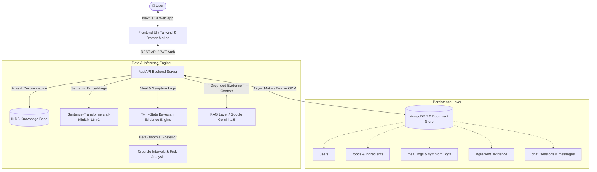
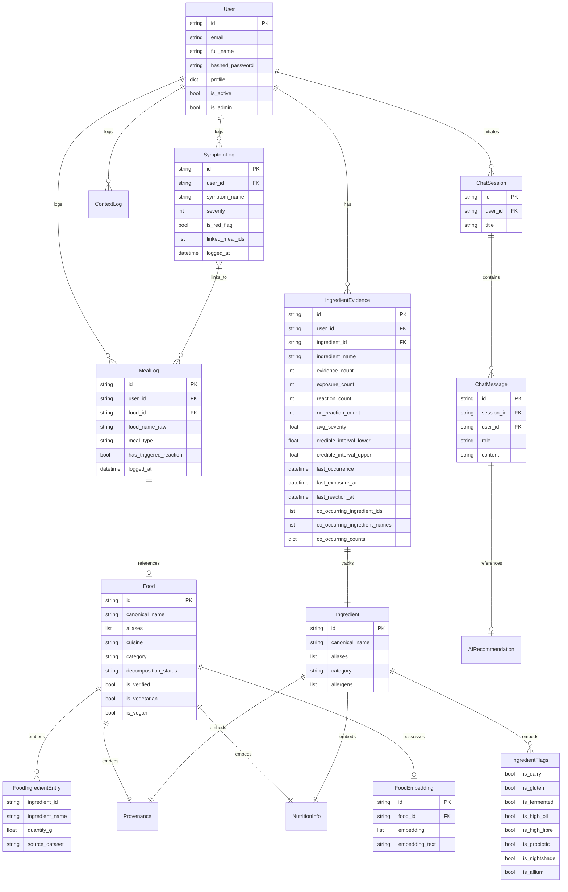

# 🌿 Personal Gut Health Tracker & Evidence Engine

> **Twin-State Bayesian Evidence Engine for Personalized Ingredient-Level Food-Symptom Correlation with Explainable RAG-Grounded Recommendations**

---

## 📑 Research & Academic Publication

This repository contains the complete implementation, database pipelines, Bayesian evidence engine, and user interface for the academic research paper:

> **"Twin-State Bayesian Evidence Engine for Personalized Ingredient-Level Food-Symptom Correlation with Explainable RAG-Grounded Recommendations"**  
> **Author**: Basava S H  
> **Affiliation**: Department of Computer Science & Engineering, Ramaiah Institute of Technology, Bengaluru, India  
> **Contact**: `basavabasava5585@gmail.com`  

### IEEE Initial Submission
The manuscript has been submitted for peer review to an IEEE Conference.

### IEEE Initial Submission Status
Awaiting for Associate Editor (AE) Assignment.

---

## 📸 System Showcase

| **1. Regional Food Search & Atomic Deconstruction** | **2. Gut Health Insights Dashboard (User 2)** |
|:---:|:---:|
|  |  |
| *Deconstructs composite dishes into raw ingredients, allergens, and nutritional profiles in real time.* | *Visualizes Bayesian trigger probabilities, credible intervals, and evidence exposure counts.* |

| **3. Grounded Zero-Hallucination AI Chat (User 2)** | **4. IEEE Conference Submission Confirmation** |
|:---:|:---:|
|  |  |
| *Retrieval-Augmented Generation that only answers using mathematically computed personal evidence.* | *Official submission confirmation of research paper to IEEE conference.* |

---

## 💡 The Problem & Research Gap

Traditional food-symptom logging applications suffer from four foundational flaws:
1. **The Composite Meal Dilemma**: When a user logs a dish (e.g., *Masala Dosa*, *Chicken Biryani*, or *Sambar*), they consume 8 to 15 distinct ingredients simultaneously. Standard tracking apps treat the meal as an indivisible black box, unable to isolate whether the culprit was fermented batter, nightshades, alliums, or cooking oil.
2. **Collinearity & Confounders**: In real-world diets, certain ingredients almost always co-occur (e.g., onion and garlic in curry bases; rice and lentils in South Indian cuisine). Naive statistical models falsely accuse harmless companion ingredients.
3. **Reporting Bias & Spurious Correlations**: Users disproportionately log on days they feel unwell. Frequently eaten safe staples (like plain rice or water) correlate spuriously with symptom events.
4. **Dangerous LLM Hallucinations**: Commercial generative AI chatbots guess diagnoses, fabricate food allergies, or prescribe restrictive elimination diets with false confidence.

---

## 🔬 Core Novelties & Scientific Contributions

### 1. Atomic Ingredient Decomposition & Regional Alias Resolution
- Employs the **INDB (Indian Nutrient Databank)** knowledge graph containing over 300 curated regional dishes and 170+ atomic ingredients.
- Built-in phonetic and colloquial alias mapper translates vernacular dish names (e.g., *Mosaranna*, *Thayir Sadam*, *Daddojanam* → `Curd Rice`; *Saaru*, *Charu* → `Rasam`) before resolving into granular constituents.

### 2. Twin-State Bayesian Evidence Engine (Beta-Binomial Model)
- Rather than calculating a single misleading correlation percentage, every ingredient exposure is evaluated as a conjugate Bayesian model:
  $$\text{Prior: } \text{Beta}(\alpha_0, \beta_0) \quad \xrightarrow{+\text{Exposures}, +\text{Reactions}} \quad \text{Posterior: } \text{Beta}(\alpha_0 + k, \beta_0 + n - k)$$
- Generates **$95\%$ Credible Intervals** $[\theta_{\text{lower}}, \theta_{\text{upper}}]$. When data is thin, intervals widen transparently to reflect genuine uncertainty.

### 3. Co-Occurrence & Collinearity Disentanglement
- Tracks pairwise co-occurrence frequencies (`co_occurring_counts`) across all meal events.
- Employs dynamic logging density and baseline reaction rates to suppress false positives caused by shared curry bases or habitual staple pairings.

### 4. Zero-Hallucination Grounded RAG Architecture
- LLM inference is strictly constrained: the model is forbidden from drawing upon generic training data for health advice.
- Prompts enforce strict retrieval of the user's mathematically computed `IngredientEvidence` records. If statistical evidence is insufficient, the system explicitly answers: *"Insufficient evidence logged to establish a correlation."*

---

## 🏗️ System Architecture

---

## 💻 Tech Stack

| Layer | Technology | Description |
|:---|:---|:---|
| **Frontend** | **Next.js 14+ (App Router)** | Modern React 19 framework with Server & Client components |
| **Styling & UI** | **Tailwind CSS + Framer Motion** | Glassmorphism design tokens, micro-interactions, responsive dashboard |
| **Backend** | **FastAPI (Python 3.11)** | High-performance asynchronous REST API with OpenAPI autodocs |
| **Database** | **MongoDB 7.0 + Beanie ODM** | Asynchronous document ODM with Motor driver |
| **Statistical Engine** | **Scipy (Beta-Binomial)** | Conjugate Bayesian updating, quantile credible intervals |
| **Embeddings** | **Sentence-Transformers** | `all-MiniLM-L6-v2` generating 384-dimensional semantic vectors |
| **LLM Orchestration** | **Google Gemini Flash** | Provider-abstracted RAG pipeline (Gemini, OpenAI, Anthropic, DeepSeek) |
| **Containerization** | **Docker & Docker Compose** | Multi-service local and cloud deployment orchestration |

---

## 🗄️ Database Schema Highlights

The system is powered by MongoDB collections structured via Beanie ODM models:
- **`User`**: User credentials (bcrypt), profile preferences, dietary restrictions, admin flags.
- **`Food`**: Canonical names, dialectal aliases, regional cuisine, embedded `FoodIngredientEntry` list, and nutritional macros per 100g.
- **`Ingredient`**: Atomic ingredients with biochemical classification flags (`is_dairy`, `is_gluten`, `is_fermented`, `is_nightshade`, `is_allium`, `is_high_oil`).
- **`MealLog` & `SymptomLog`**: Timestamped meal and symptom event documents linked by chronological ingestion windows.
- **`IngredientEvidence`**: Twin-state evidence counters (`exposure_count`, `reaction_count`, `no_reaction_count`), average severity, Bayesian credible intervals (`credible_interval_lower`, `credible_interval_upper`), and co-occurrence frequency matrices.
- **`ChatSession` & `ChatMessage`**: Grounded chat logs linking AI recommendations directly to stored evidence snapshots.

---

